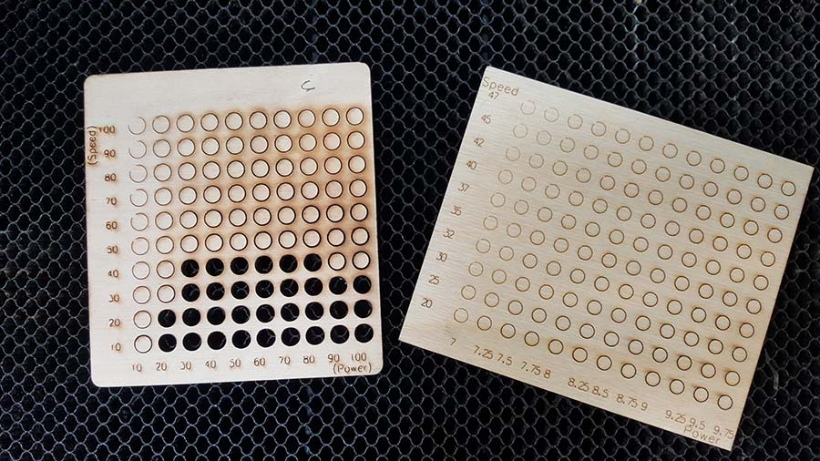

# Gcode generator
## Purpose
This generator will give a matrix of circles with your speed and power values.

You can customise :
* circle
* speed range
* power range
* file name

the PHP version is given as reference, but is no longer maintained. 
Please use the Python script.

## Usage
In main.py script, you can customise :

* File name for the gcode storage
```fileName = "C:/Your/output/Documents/GabaritDecoupe.gcode"```


* Speed and power of your laser
```speedRange = [2,4,6,8,10,12,14,16,18,20]```
```powerRange = [5,5.25,5.5,5.75,6,6.25,6.5,6.75,7]```

This will produce a gcode file that you can visualise in [camotics ](https://camotics.org/). The gcode will display
a grid with as many circles needed to cover all the possibility you defined in speed and power ranges.

